# 🚀 Job Application AI Assistant (Local GenAI)


AI-powered Job Application Assistant built with FastAPI, Streamlit, Ollama, Docker, and Kubernetes.

A complete local GenAI project for:
- Resume optimization
- Cover letter generation
- Interview preparation
- ATS resume analysis
- Career AI chat assistant

---

## Features

✅ Resume bullet point generation  
✅ ATS-friendly cover letter generation  
✅ Interview question generation  
✅ ATS score analysis  
✅ Career AI chat assistant  
✅ PDF / DOCX / TXT resume upload  
✅ Resume preview  
✅ Download generated outputs  
✅ Multi-model Ollama support  
✅ Session history memory  
✅ Streamlit polished UI  
✅ FastAPI REST APIs  
✅ Docker support  
✅ Docker Compose support  
✅ Kubernetes deployment manifests  

---

## Tech Stack

### Backend
- Python
- FastAPI
- Uvicorn

### Frontend
- Streamlit

### AI / GenAI
- Ollama
- Llama 3
- Mistral
- Phi-3
- DeepSeek Coder

### DevOps
- Docker
- Docker Compose
- Kubernetes

---

## Supported Models

```text
deepseek-v3.1:671b-cloud
glm-4.6:cloud
minimax-m2:cloud
qwen3-vl:235b-cloud
qwen3-coder:480b-cloud
gpt-oss:120b-cloud
deepseek-coder:latest
llama3:latest
mistral:latest
llama3:instruct
phi3:latest
llama3:8b
````

---


## Project Structure

```text
job-application-ai-assistant/
│
├── app/
│   ├── models/
│   │   └── request_models.py
│   │
│   ├── prompts/
│   │   └── prompts.py
│   │
│   ├── routes/
│   │   └── resume_routes.py
│   │
│   ├── services/
│   │   ├── file_parser.py
│   │   └── openai_service.py
│   │
│   ├── main.py
│   └── ui.py
│
├── k8s/
│   ├── namespace.yaml
│   ├── configmap.yaml
│   ├── deployment.yaml
│   └── service.yaml
│
├── Dockerfile
├── docker-compose.yml
├── requirements.txt
└── README.md
```

---

## Installation

### Clone Repository

```bash
git clone https://github.com/satya66123/job-application-ai-assistant.git
cd job-application-ai-assistant
```

---

## Python Local Setup

Create virtual environment:

```bash
python -m venv .venv
```

Activate:

Windows:

```bash
.venv\Scripts\activate
```

Linux / Mac:

```bash
source .venv/bin/activate
```

Install dependencies:

```bash
pip install -r requirements.txt
```

---

## Install Ollama

Install Ollama:

[https://ollama.com](https://ollama.com)

Pull models:

```bash
ollama pull llama3
ollama pull mistral
ollama pull phi3
ollama pull deepseek-coder
ollama pull llama3:instruct
ollama pull llama3:8b
```

Start Ollama:

```bash
ollama serve
```

---

## Run Locally

Backend:

```bash
uvicorn app.main:app --reload
```

Frontend:

```bash
streamlit run app/ui.py
```

FastAPI Swagger:

```text
http://localhost:8000/docs
```

Streamlit UI:

```text
http://localhost:8501
```

---

## Docker

Build:

```bash
docker build -t job-ai-assistant .
```

Run:

```bash
docker-compose up --build
```

Access:

FastAPI:

```text
http://localhost:8000/docs
```

Streamlit:

```text
http://localhost:8501
```

---

## Kubernetes

Apply namespace:

```bash
kubectl apply -f k8s/namespace.yaml
```

Apply config:

```bash
kubectl apply -f k8s/configmap.yaml
```

Deploy:

```bash
kubectl apply -f k8s/deployment.yaml
```

Service:

```bash
kubectl apply -f k8s/service.yaml
```

Check:

```bash
kubectl get pods -n job-ai
kubectl get svc -n job-ai
```

Access:

FastAPI:

```text
http://localhost:30080/docs
```

Streamlit:

```text
http://localhost:30501
```

---

## API Endpoints

### Resume Generation

```text
POST /generate-resume
```

---

### Cover Letter Generation

```text
POST /generate-cover-letter
```

---

### Interview Questions

```text
POST /generate-interview-questions
```

---

### ATS Score

```text
POST /ats-score
```

---

### Career AI Chat

```text
POST /chat-assistant
```

---

## Sample Use Cases

* Optimize resume for backend jobs
* Generate ATS-friendly cover letters
* Prepare technical interview questions
* Analyze ATS keyword gaps
* Career AI assistant conversations

---

## Future Enhancements

## AI / GenAI
* RAG (Retrieval-Augmented Generation)
* Vector database integration
* Semantic resume search
* Job recommendation engine
* AI resume rewrite assistant
* AI mock interview simulator
* Voice interview assistant
* Multi-agent recruiter workflow
* Automatic model routing
* Conversation summarization

## Product Features
* Authentication / login
* User accounts
* Profile management
* Resume version management
* Saved ATS reports
* Saved chat conversations
* Project export history
* Theme switching (dark/light)
* Editable generated outputs
* One-click regenerate
* PDF report export
* DOCX export
* Email delivery support

## Backend Enhancements
* Database integration (PostgreSQL / MySQL)
* Redis caching
* Async task queue (Celery)
* Background processing
* Rate limiting
* API authentication
* Logging improvements
* Metrics monitoring
* Health check endpoints
* Config management

## Cloud / DevOps
* AWS deployment
* Azure deployment
* GCP deployment
* Helm charts
* CI/CD pipelines
* GitHub Actions
* Nginx reverse proxy
* HTTPS / SSL
* Production ingress
* Horizontal pod autoscaling

## Enterprise Features
* Multi-user support
* Role-based access
* Recruiter dashboard
* Candidate analytics
* Admin dashboard
* Resume scoring dashboard
* Batch resume processing
* Team collaboration
* Organization settings

---

## Project Status

### Completed Core MVP

✅ Fully functional

✅ Portfolio ready

✅ Dockerized

✅ Kubernetes ready

✅ Multi-model GenAI

✅ Chat assistant enabled

✅ Local deployment ready

---

## Author

Satya Srinath Nekkanti

---

# Application Screenshots

## Welcome Screen
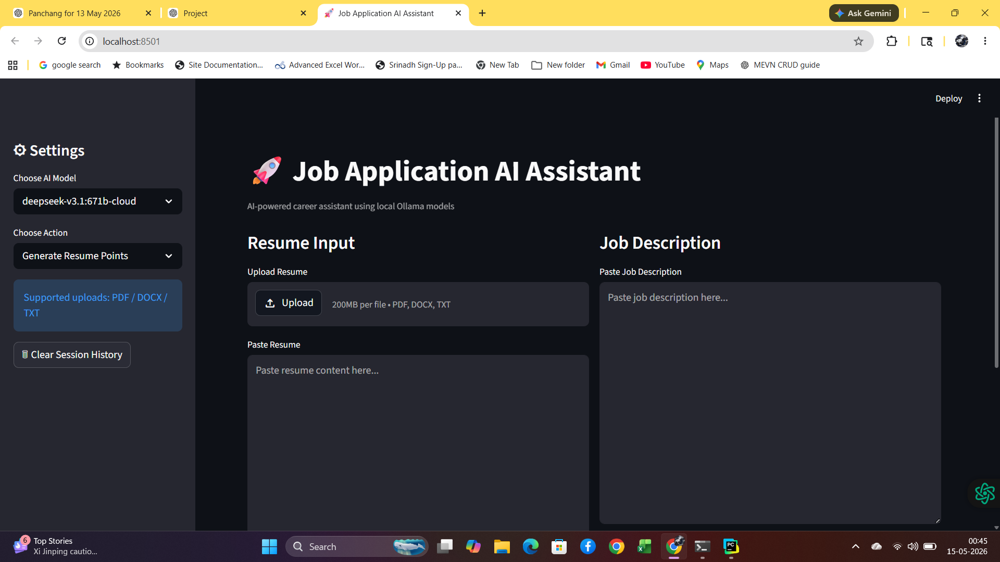
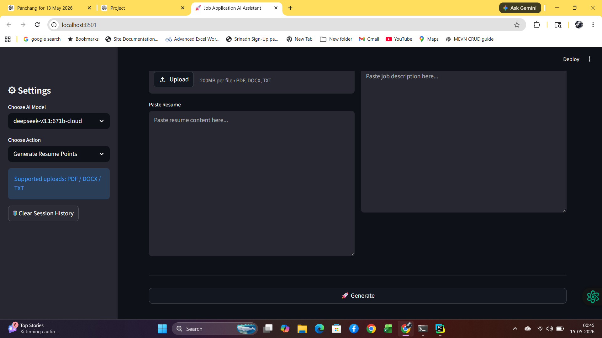

## Input Screen
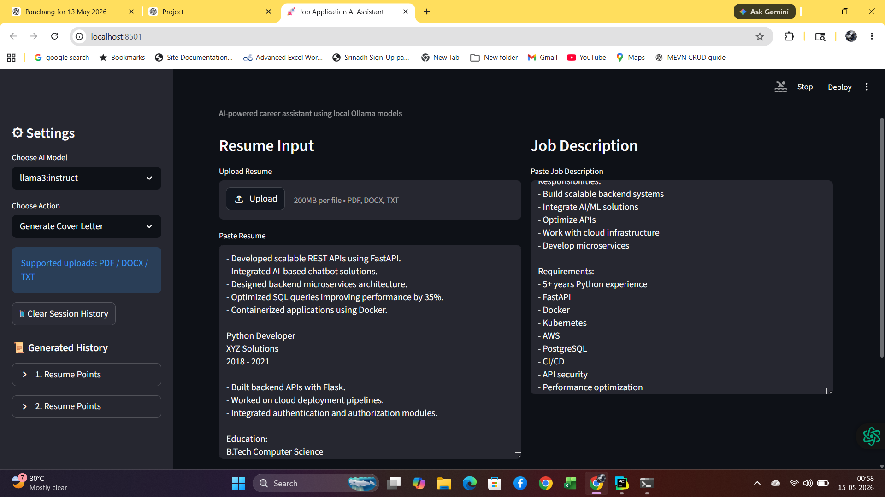

## Resume Optimization
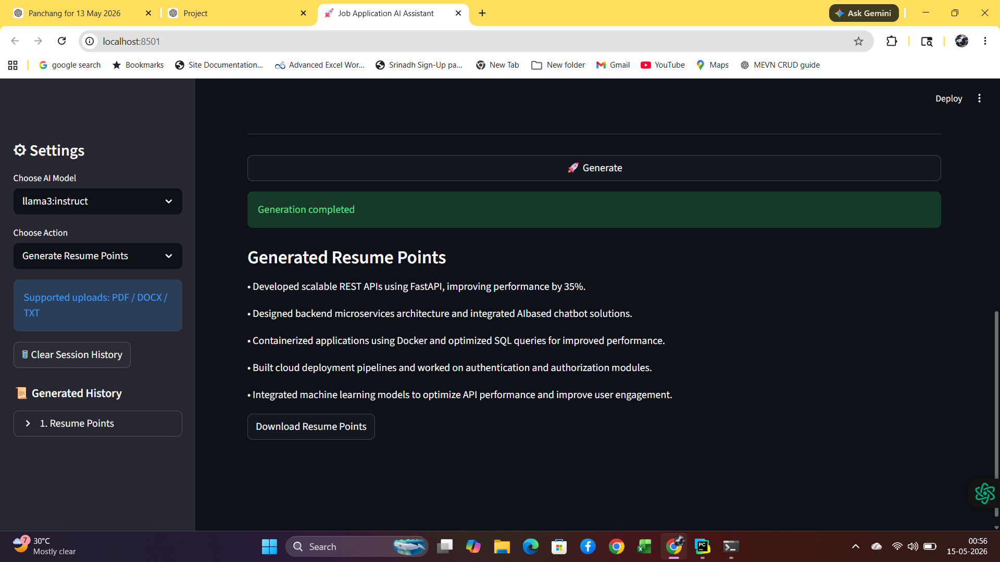

## Cover Letter Generation
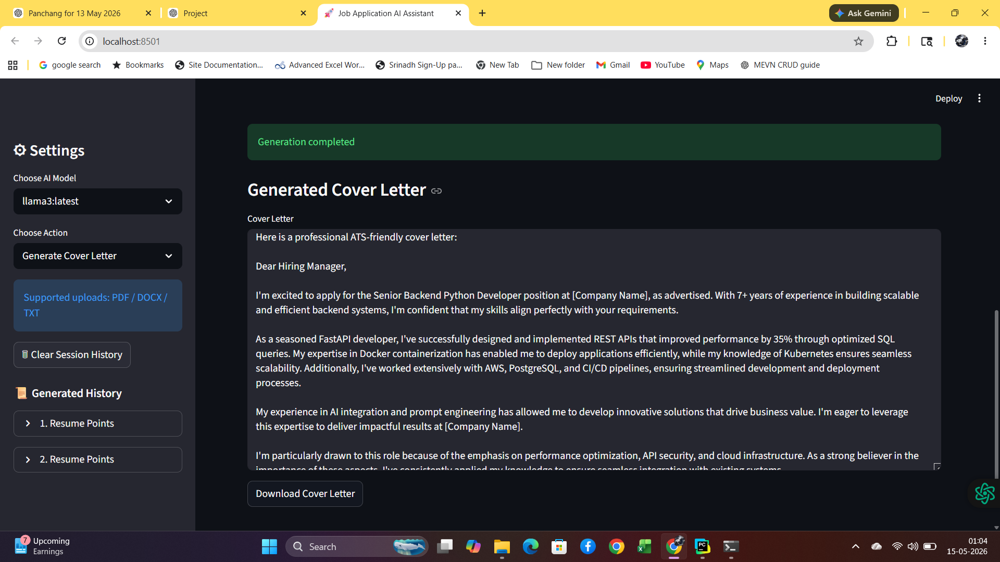

## Interview Questions
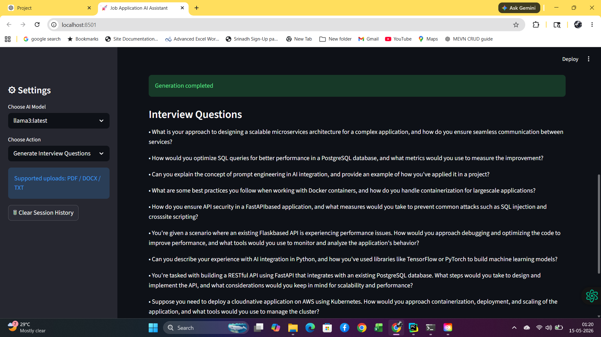
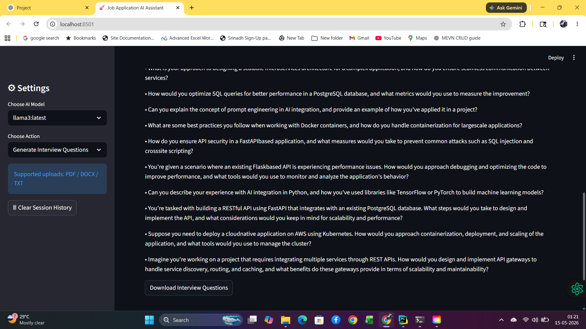

## ATS Missing Keywords
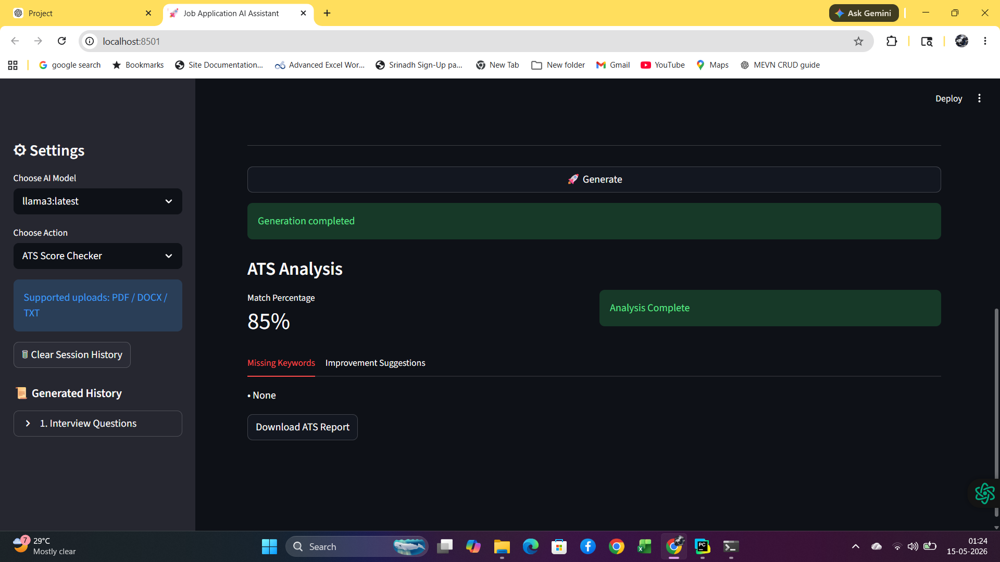

## ATS Suggestions
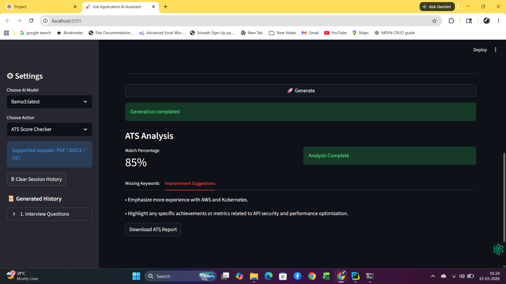

## Career AI Chat
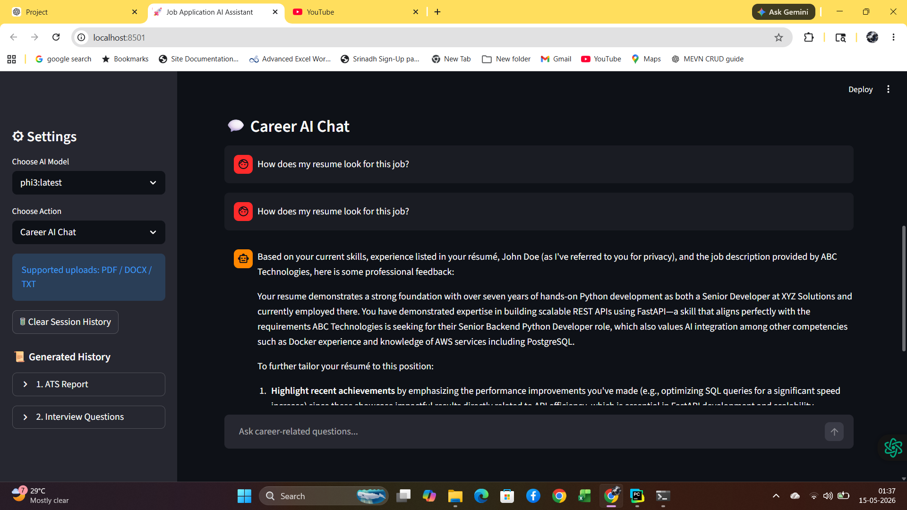
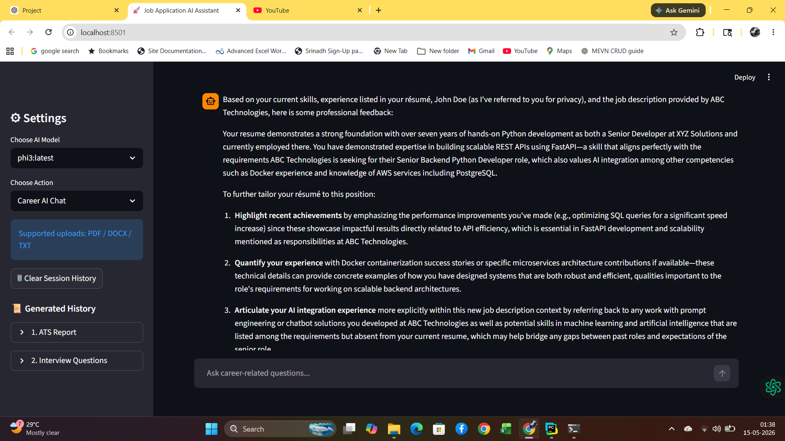
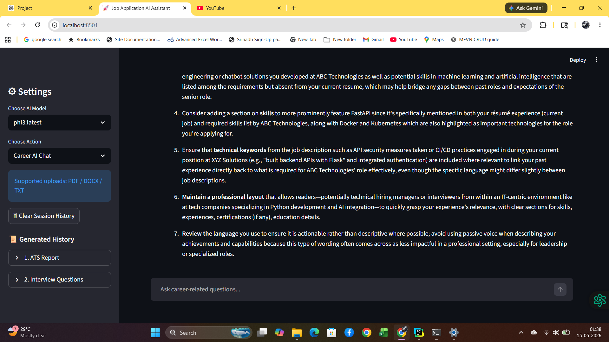


---


## License

## MIT

````
MIT License

Copyright (c) 2026 satya

Permission is hereby granted, free of charge, to any person obtaining a copy
of this software and associated documentation files (the "Software"), to deal
in the Software without restriction, including without limitation the rights
to use, copy, modify, merge, publish, distribute, sublicense, and/or sell
copies of the Software, and to permit persons to whom the Software is
furnished to do so, subject to the following conditions:

The above copyright notice and this permission notice shall be included in all
copies or substantial portions of the Software.

THE SOFTWARE IS PROVIDED "AS IS", WITHOUT WARRANTY OF ANY KIND, EXPRESS OR
IMPLIED, INCLUDING BUT NOT LIMITED TO THE WARRANTIES OF MERCHANTABILITY,
FITNESS FOR A PARTICULAR PURPOSE AND NONINFRINGEMENT. IN NO EVENT SHALL THE
AUTHORS OR COPYRIGHT HOLDERS BE LIABLE FOR ANY CLAIM, DAMAGES OR OTHER
LIABILITY, WHETHER IN AN ACTION OF CONTRACT, TORT OR OTHERWISE, ARISING FROM,
OUT OF OR IN CONNECTION WITH THE SOFTWARE OR THE USE OR OTHER DEALINGS IN THE
SOFTWARE.
````

---

### Git commands

```bash
git add .
git commit -m "Completed Day 3: session history, Docker, Kubernetes, README documentation"
git push origin main
```
---

# Project Status

## Current Status: COMPLETED ✅


This project has successfully reached **Completed MVP / Portfolio Ready** status.

### Completed Deliverables

✅ FastAPI backend APIs  
✅ Streamlit frontend UI  
✅ Local Ollama multi-model AI integration  
✅ Resume optimization engine  
✅ ATS-friendly cover letter generation  
✅ Interview question generator  
✅ ATS resume analyzer  
✅ Career AI chat assistant  
✅ PDF / DOCX / TXT upload support  
✅ Resume preview system  
✅ Session history memory  
✅ Downloadable outputs  
✅ Swagger API docs  
✅ Error handling + timeout protection  
✅ Docker containerization  
✅ Docker Compose setup  
✅ Kubernetes deployment manifests  
✅ README documentation  
✅ GitHub project readiness  

### Deployment Readiness

| Capability | Status |
|----------|--------|
| Local Development | ✅ Completed |
| Docker Deployment | ✅ Completed |
| Docker Compose | ✅ Completed |
| Kubernetes | ✅ Completed |
| Portfolio Showcase | ✅ Completed |
| MVP Feature Set | ✅ Completed |

### Future Scope
Future enhancements are optional expansion features, not blockers for project completion.

---


